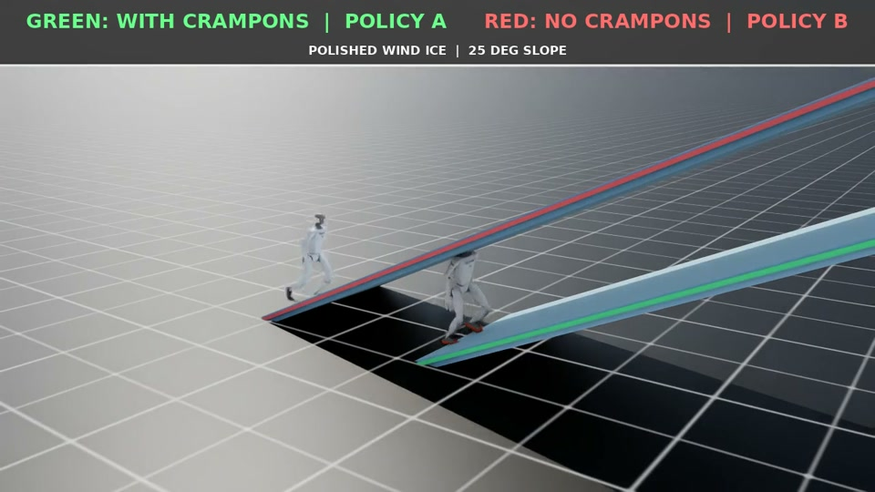
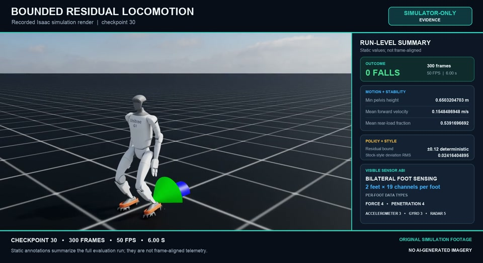
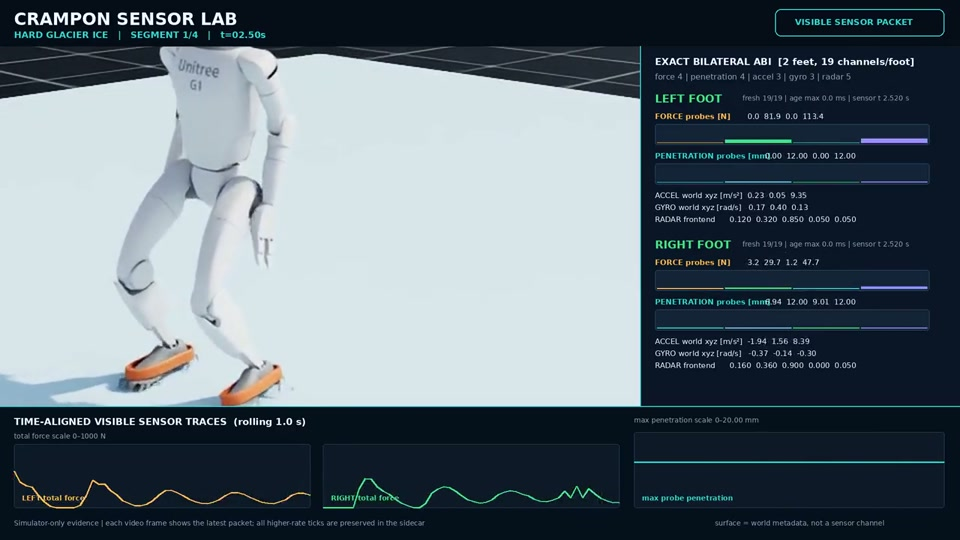
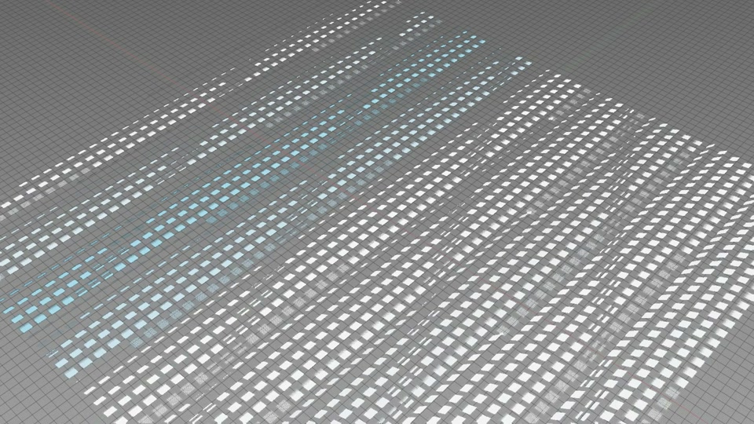
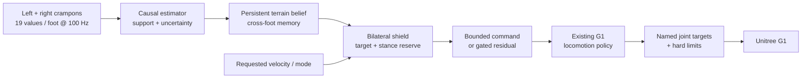

<div align="center">

# DeepSense · Hackathon Everest

### A sensorized crampon and drop-in control layer for more stable Unitree G1 locomotion on extreme terrain

[](https://github.com/joshuajerin/hackathon-everest/actions/workflows/ci.yml)
[](https://www.python.org/)
[](docs/ISAACLAB_QUICKSTART.md)
[](docs/MUJOCO_SETUP.md)
[](LICENSE)

DeepSense instruments both crampons, estimates contact support from hardware-shaped sensor packets, remembers
terrain state across steps, and supervises an existing locomotion policy before unstable weight transfer.

[Watch the demos](#video-showcase) · [Run the CPU demo](#quickstart) · [Set up Isaac Lab](docs/ISAACLAB_QUICKSTART.md) · [Read the architecture](docs/ARCHITECTURE.md)

</div>

> [!IMPORTANT]
> This repository contains experimental simulator software. The snow/ice parameters are project-authored
> priors, not field calibration. Nothing here is physical-robot validation, an Everest digital twin, or
> evidence that a robot is ready for mountain deployment.

## Video showcase

Click any frame to open the MP4. These are native Isaac Lab simulator recordings published with hashes and
provenance in [`docs/media/manifest.json`](docs/media/manifest.json).

<table>
<tr>
<td width="50%" valign="top">
<a href="docs/media/polished-wind-ice-25deg-comparison.mp4"></a>
<br><strong>Polished wind ice · 25° comparison</strong><br>
Same Isaac process and matched material draw. Green is the crampon policy; red is a low-grip no-crampon proxy.
</td>
<td width="50%" valign="top">
<a href="docs/media/bounded-residual-locomotion.mp4"></a>
<br><strong>Bounded-residual locomotion</strong><br>
A six-second simulator render of the contact-gated correction path. Overlay values are static run summaries, not frame-aligned telemetry.
</td>
</tr>
<tr>
<td width="50%" valign="top">
<a href="docs/media/bilateral-sensor-packet-demo.mp4"></a>
<br><strong>Bilateral sensor packet</strong><br>
Two feet × 19 visible values: force, penetration, IMU, and decoded radar frontend at the controller boundary.
</td>
<td width="50%" valign="top">
<a href="docs/media/everest-suite-2160-world-tour.mp4"></a>
<br><strong>2,160-world stress-suite tour</strong><br>
Nine surface families × ten inclines × eight hazards × three contact modes, authored as parallel Isaac worlds.
</td>
</tr>
</table>

The comparison clips are **whole-system visual ablations**, not calibrated hardware-effect measurements. The
baseline uses a low-grip proxy and a different policy artifact. See the media manifest and
[`docs/DEEPSENSE_TECHNICAL_PLAYBOOK.md`](docs/DEEPSENSE_TECHNICAL_PLAYBOOK.md) before quoting results.

## What DeepSense adds

A generic walking policy already knows how to produce G1 joint targets. DeepSense leaves that core replaceable
and adds a contact-assurance path around it:

1. **Sense:** emit one synchronized 19-value packet per foot at 100 Hz.
2. **Estimate:** infer bearing, shear, support depth, failure risk, and uncertainty from causal history.
3. **Remember:** update a persistent local belief map with contact, compaction, fracture, and cross-foot evidence.
4. **Check both feet:** evaluate the target and loaded stance foot through the planned transfer.
5. **Supervise:** bound velocity/mode commands. An experimental adapter can apply a separately trained, gated, rate-limited joint residual after it is wired to the exact policy ABI.
6. **Fail closed:** hold, stop, or request recovery when packets are stale, invalid, uncertain, or unsafe.



## Feature status

| Capability | Status | Evidence / boundary |
|---|---|---|
| Reduced-order terrain → sensor → estimator → map → controller pipeline | ✅ Runnable | CPU demo and root test suite |
| Exact bilateral sensor ABI | ✅ Implemented | 19 values per foot; validity, age, and context remain separate |
| Persistent compaction, damage, fracture, and crater state | ✅ Implemented | Reduced model plus stateful Isaac contact extension |
| Single-foot MuJoCo geometry and hybrid ice fixtures | ✅ Runnable | Optional `mujoco` dependency |
| Complete 26-object crampon USD composition | ✅ Implemented | Asset authority and hashes under `configs/isaaclab/` |
| Native Isaac Lab task, sensors, stateful contact, shield, and runners | ✅ Implemented | External extension under `isaaclab_ext/` |
| Everest-inspired stress suite | ✅ Configured | 2,160 physical cases; 12,960 case/fault exposures after six cycles |
| GPU simulator recordings | ✅ Published | README media bundle with SHA-256 provenance |
| Calibrated stock-foot vs physical-crampon effectiveness | 🚧 Not yet | Current no-crampon lane is a low-grip simulator proxy |
| Physical snow/ice sensor calibration | 🚧 Not yet | Requires the actual spike/foot and a six-axis test rig |
| Guaranteed exact replant and field deployment | 🚧 Not yet | Requires validated footstep/whole-body control and progressive hardware tests |

## Exact sensor contract

Each foot emits exactly **19 sensor values** at one timestamp:

| Input | Count | Purpose |
|---|---:|---|
| Four spike axial forces | 4 | Load sharing, stiffness, and force-drop evidence |
| Four penetration readings | 4 | Sinkage, engagement, and layer response |
| Foot accelerometer | 3 | Touchdown, collapse, and vibration signatures |
| Foot gyroscope | 3 | Rotation, chatter, and loss-of-purchase signatures |
| Decoded radar frontend | 5 | Interfaces, return strength, void likelihood, and uncertainty |
| **Total per foot** | **19** | Synchronized hardware-shaped packet |

A separate 19-bit validity mask and sample age accompany the values. G1 pose, velocity, pelvis state, commands,
and body load are explicit context—not extra crampon channels. Exact simulator contact vectors and material
parameters remain labels or diagnostics and never enter the deployable actor.

## Quickstart

Requirements: Python 3.12 and [uv](https://docs.astral.sh/uv/).

```bash
git clone https://github.com/joshuajerin/hackathon-everest.git
cd hackathon-everest
make setup
make verify
```

Open the generated smoke report:

```bash
open artifacts/smoke/report.html       # macOS
xdg-open artifacts/smoke/report.html   # Linux
```

The larger reproducible CPU demo is:

```bash
uv run everest pipeline --config configs/hackathon.yaml --out artifacts/hackathon
```

It generates a grouped synthetic dataset, trains the transparent ExtraTrees baseline, replays the bilateral
scheduler, runs the current-contact ablation, and writes a self-contained HTML report and manifest.

### Useful commands

```bash
make lint                 # Ruff
make test                 # reduced-order tests
make test-isaac-unit      # Isaac-neutral extension tests (installs root GPU/Torch extra)
make smoke                # fast end-to-end CPU pipeline
make verify-all           # core verification + Isaac-neutral extension tests
make build                # wheel + source distribution

uv run everest contract
uv run everest generate --episodes 800 --fields 100 --out artifacts/probes.npz
uv run everest train --dataset artifacts/probes.npz --model artifacts/model.joblib
uv run everest replay --model artifacts/model.joblib --steps 6 --out artifacts/replay.json
```

### Optional MuJoCo fixtures

```bash
uv sync --extra mujoco --group dev
uv run everest mujoco-probe --load 150 --duration 1.2 --out artifacts/mujoco_probe
uv run everest mujoco-ice-probe --load 150 --duration 1.5 --out artifacts/mujoco_ice_probe
```

## Isaac Lab GPU path

Native Isaac work requires Linux, an NVIDIA GPU, the official G1 asset/checkpoint pair, and the pinned stack in
[`isaaclab_ext/stack.lock.json`](isaaclab_ext/stack.lock.json). The full walkthrough covers extension install,
asset composition, probe data, shadow/active evaluation, comparison renders, and safe artifact sync:

**[Open the Isaac Lab quickstart →](docs/ISAACLAB_QUICKSTART.md)**

Recorded README media came from the pinned GPU artifact store. The GPU host was not reachable during the latest
repository refresh, so no fresh remote job or checkpoint was claimed; the published copies were decoded and
hashed locally.

## Three simulation levels

| Level | Purpose | Backend |
|---|---|---|
| **L0 · Probe farm** | Cheap causal sensor/label generation and estimator training | Reduced-order Python or vector Isaac fixtures |
| **L1 · Full G1** | Closed-loop gait, bilateral loading, sensor faults, and policy supervision | Isaac Lab manager-based environment |
| **L2 · Discrepancy / calibration** | Geometry checks, alternate dynamics, and eventual rig replay | MuJoCo hybrid fixtures and physical test data |

No simulator is called ground truth. Physical calibration remains the authority for real contact behavior.

## Pipeline outputs

`everest pipeline` writes:

- `probe_dataset.npz` — causal 50/100/150/225/300 ms prefixes;
- `terrain_estimator.joblib` — continuous and event estimator;
- `metrics.json` — grouped held-out metrics and false-safe rate;
- `replay.json` — estimates, map evidence, reserves, and decisions;
- `benchmark.json` — current-contact-only versus map + bilateral reasoning;
- `terrain_belief.png` — truth, controller belief, and uncertainty diagnostics;
- `report.html` — self-contained demo report;
- `manifest.json` — schema, config, dependencies, seeds, Git state, feature order, and limitations.

## Repository layout

```text
src/hackathon_everest/         CPU reference pipeline and stable contracts
isaaclab_ext/                  external Isaac Lab extension, runners, and unit tests
configs/                       reduced-order, material-prior, and Isaac suite configuration
assets/                        source crampon geometry and G1 compatibility assets
mujoco/                        single-foot and slope fixtures
blender/                       editable crampon fit authority and export tools
scripts/                       asset, calibration, bootstrap, and analysis commands
tests/                         reduced-order contract and pipeline tests
docs/                          architecture, setup, calibration, scope, and evidence guides
docs/media/                    reviewed README media plus provenance manifest
```

## Documentation

- [Architecture](docs/ARCHITECTURE.md)
- [Isaac Lab quickstart](docs/ISAACLAB_QUICKSTART.md)
- [DeepSense technical playbook](docs/DEEPSENSE_TECHNICAL_PLAYBOOK.md)
- [Ice simulation and sim-to-real funnel](docs/ICE_SIM_TO_REAL.md)
- [MuJoCo setup](docs/MUJOCO_SETUP.md)
- [Real-data boundary](docs/REAL_DATA.md)
- [Hackathon scope](docs/HACKATHON_SCOPE.md)
- [Submission kit](docs/SUBMISSION.md)
- [Contributing](CONTRIBUTING.md)

## Evidence rules

- Report safety and progress together. A controller that only stops is not useful.
- Keep train/calibration/test groups separated by terrain/world/site lineage.
- Preserve asset, policy, checkpoint, config, simulator, and output hashes.
- Label visual-only geometry, simulator truth, decoded sensor values, and deployable inputs separately.
- Treat the comparison videos as controlled simulator proxies—not physical effectiveness claims.
- Treat the 2,160 cases as authored stress tests—not surveyed Everest frequencies.

## License

[MIT](LICENSE) for original project code. Third-party robot assets, policies, simulator packages, user-supplied
CAD, and media retain separate terms; see [Third-party notices and asset provenance](THIRD_PARTY_NOTICES.md).
