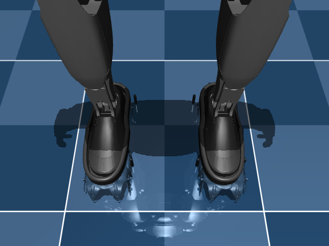

# MuJoCo crampon setup

## Enlarged ankle-cavity fit

The user asset now uses a uniform final scale of `108`, which is `1.08×` the initial dimension-inferred
scale. The shallow cavity is approximately `226.24 × 81.82 mm` at the measured section. The official G1
ankle-roll visual has an XY bounding box of `208.21 × 75.58 mm`. This leaves about `9.0 mm` fore-aft and
`3.1 mm` lateral clearance per side, so the gray stock foot sits inside the black cavity rather than clipping
its rim. The full crampon envelope is approximately `282.77 × 100.16 × 65.22 mm`.



This remains a render/section check because STL units are absent and the meshes are not manufacturing CAD.


## Blender fit authority

The current MuJoCo geometry is exported from `blender/g1_crampon_fit.blend`, not reconstructed from a guessed
scale. The saved controller translation is approximately `(+20.43, +0.22, -40.25) mm`, with no rotation and
uniform scale `1.08`. Applying it produces fitted mesh bounds
`[-100.17, -49.18, -78.71]` to `[182.60, 50.98, -13.49] mm` in ankle-roll coordinates.

```bash
./scripts/apply_blender_fit.sh
```

The G1 builder raises the stand keyframe by `46.07 mm` for this deeper fitted tip envelope. This is generated
from metadata and will change automatically after a new saved Blender export.

## Single-foot gate

Install the optional engine and run the deterministic vertical fixture:

```bash
uv sync --extra mujoco --group dev
uv run everest mujoco-probe --load 150 --duration 1.2 --out artifacts/mujoco_probe
# Deliberately traction-free incline control: expect downhill drift/load redistribution.
uv run everest mujoco-probe --load 150 --duration 1.2 --slope-deg 10 \
  --lateral-drive-force 15 --out artifacts/mujoco_plane_slope
```

The fixture uses the user-supplied visual assembly, four spring-loaded analytical probes, a crampon IMU site,
and a radar origin. Its compiled sensor buffer is exactly 19 values in production order. It runs physics at
4 kHz and emits packets at 100 Hz.

The fixture deliberately uses `condim=1` and a hard plane for a stable vertical load calibration. It validates
geometry, signs, units, load balance, axial-force projection, and sensor wiring. `--slope-deg` rotates the plane
about world Y; the carriage may translate in world X. The rigid-plane slope command is a no-traction control, so
it should drift downhill and redistribute load. It does not validate lateral ice traction.

Run the stateful hybrid ice prior instead:

```bash
uv run everest mujoco-ice-probe --load 150 --duration 1.5 \
  --seed 41 --out artifacts/mujoco_ice_probe
# Hybrid material-law incline/lateral sweep; this is not native MuJoCo ice.
uv run everest mujoco-ice-probe --load 150 --duration 1.2 --seed 41 \
  --slope-deg 5 --lateral-drive-force 15 --out artifacts/mujoco_ice_slope
```

MuJoCo contact with the plane is disabled in that run. `StatefulIceSpikeContact` applies per-spike normal and
bounded shear forces from exact tip kinematics. `--slope-deg` measures depth along the plane normal, and
`--lateral-drive-force` applies a world-X sweep load. `packets.npz` contains only estimator-visible values.
Exact ice penetration, shear capacity, vector contact force, and fracture state remain simulator diagnostics in
`simulator_truth_do_not_feed_estimator.npz`.

A higher-load rig check can exercise brittle force drops without pretending it is a nominal step:

```bash
uv run everest mujoco-ice-probe --load 600 --duration 1.5 --seed 41 \
  --out artifacts/mujoco_ice_fracture
```

## Official G1 attachment

Fetch the exact reviewed Menagerie revision and build a derived model:

```bash
uv run python scripts/fetch_g1_menagerie.py
uv run python scripts/build_g1_crampon.py
```

Pinned upstream revision: `da76818e269b82289eba39808e2fb91d679d6994`.

Generated files are under `build/mujoco_g1/unitree_g1/`:

- `g1_crampon.xml`;
- `scene_crampon.xml`;
- `everest_provenance.json`;
- copied official and project mesh assets.

The script preserves the official checkout. It attaches to `left_ankle_roll_link` and
`right_ankle_roll_link`, adds eight probe DOFs, removes collision paths that bypass the probes, transfers the
official stand keyframe by joint and actuator name, raises the base 5.5 mm to account for the enlarged tip envelope and avoid initial penetration, and
compiles the result as a final check.

The generated scene currently has `nq=44`, `nv=43`, `nu=29`, and 50 sensor values: 12 official torso/pelvis IMU
values plus two independent 19-value crampon layouts. G1 proprioception remains separate context.

## Current validation results

The single-foot hard-plane fixture at 150 N produced:

- exactly 120 packets over 1.2 s at 100 Hz;
- `37.5 N` steady force at each probe;
- `4.679 mm` steady moving-probe travel;
- only `ice_plane <-> probe_0..3_geom` contacts;
- finite state and a 19-value sensor matrix.

The hybrid seed-41 ice prior at 150 N produced about `0.22–0.42 mm` material penetration, about
`36.7–38.3 N` per spike, and heterogeneous shear capacities. A 600 N calibration-envelope run fractured one
of four randomized contacts. These are deterministic software checks under sampled priors, not measured ice
validation.

The full G1 model compiles and initially contacts the floor only through eight named crampon spikes. A
one-second passive/position-controlled stand remains finite, but this is not a whole-body balance controller.
It must not be described as walking.

## Next gates

1. Render and manually confirm boot/ankle visual fit against a known dimension.
2. Compare the slope/lateral-sweep response against an instrumented spike rig; the current response is a prior.
3. Fit ice posterior ranges from the actual spike rig.
4. Add sensor noise, bias, dropout, saturation, and latency after the dynamics step.
5. Replay the existing estimator on the single-foot MuJoCo packets.
6. Stabilize scripted double support before any stepping.
